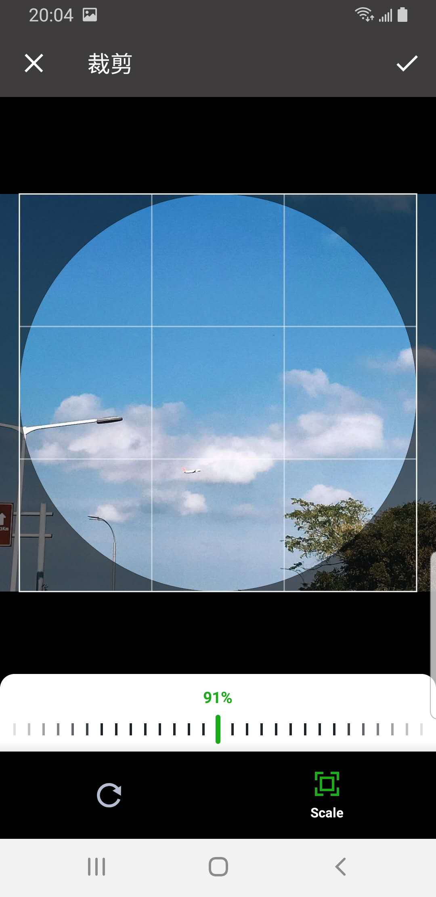

## XPicker

提供 简便的照片选择器功能，图片Crop，视频录制，照相

[](https://jitpack.io/#wangshuwen1107/xpicker)


### 展示
  


### 说明

1.该库仅支持AndroidX

2.minSdkVersion 21

### 添加依赖和配置

#### 1.root project build.gradle

```gradle
buildscript {
   repositories {
      ...
   }
   dependencies {
       ...
   }
}

allprojects {
   repositories {
       maven {
           url 'https://dl.bintray.com/wenwen/maven'
       }
   }
}
```


#### 2.module build.gradle

```gradle
dependencies {
   implementation 'cn.cheney.media:xpicker:x.x.x'
}
```


### 使用

#### 1.配置ImageLoader

```kotlin
XPicker.imageLoadListener = { imageUri, iv, mineType ->
            Glide.with(this@MyApp)
                .load(imageUri)
                .into(iv)
      }
```

#### 2.申请权限

```text
 Manifest.permission.WRITE_EXTERNAL_STORAGE
 Manifest.permission.CAMERA
 Manifest.permission.RECORD_AUDIO
 Manifest.permission.READ_EXTERNAL_STORAGE
```

#### 3.照相

```kotlin
 XPicker.ofCamera()
            .captureMode(CaptureType.MIXED)
            .start(this, object : CameraSaveCallback {
                override fun onTakePhotoSuccess(photoUri: Uri) {
              
                }

                override fun onTakePhotoFailed(errorCode: String) {
                }

                override fun onVideoSuccess(coverUri: Uri?, videoUri: Uri, duration: Int?) {
                
                }

                override fun onVideoFailed(errorCode: String) {
                }

            })

```

#### 3.图像选择器

```kotlin
  XPicker.ofPicker()
            .mineType(MineType.TYPE_ALL)
            .start(this, selectedCallback = object : SelectedCallback {
                override fun onSelected(mediaList: List<MediaEntity>?) {
                }
            })

```

#### 4.头像选择裁剪

```kotlin
 XPicker.ofCrop()
            .circleCrop(true)
            .start(this, cropCallback = object : CropCallback {
                override fun onCrop(mediaEntity: MediaEntity?) {
                }
            })
```

### 混淆

```text
 -keep class com.gyf.immersionbar.* {*;}
 -dontwarn com.gyf.immersionbar.**
 -dontwarn com.yalantis.ucrop**
 -keep class com.yalantis.ucrop** { *; }
 -keep interface com.yalantis.ucrop** { *; }

```

