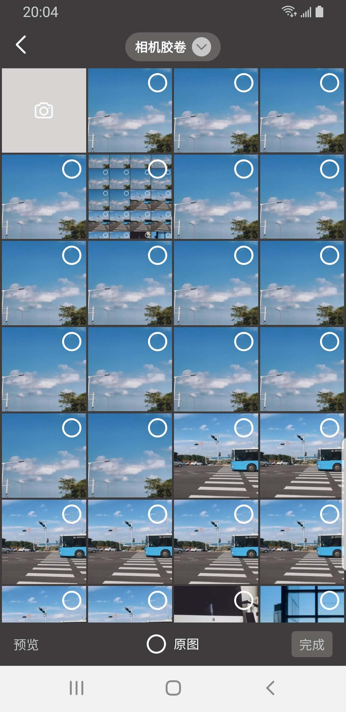

## XPicker


|            Picker             |            Preview            |
| :---------------------------: | :---------------------------: |
|  |  |


### XPicker is  a great way  to selector local image and video  for Android

- 支持筛选图片(PNG,JPEG),动图GIF,视频
- 支持图片和视频的拍摄


### 最新版本

|  模块 | camera2  |  xpicker |
| ------------ | ------------ | ------------|
| 最新版本 | | |

### Download

```gradle
repositories {
   mavenCentral()
}

dependencies {
    implementation "io.github.wangshuwen1107:camera2:$latest_version"
    implementation "io.github.wangshuwen1107:xpicker:$latest_version"
}
```

### USE

#### 1. configuration imageLoad

```kotlin
XPicker.imageLoadListener = { imageUri, iv, mineType ->
            Glide.with(this@MyApp)
                .load(imageUri)
                .into(iv)
      }
```

#### 2.request permission

```text
 Manifest.permission.CAMERA
 Manifest.permission.RECORD_AUDIO
 Manifest.permission.READ_EXTERNAL_STORAGE
```

#### 3.Action

```kotlin
XPicker.ofCamera()
        .captureMode(CaptureType.MIXED)
        .start(this,CameraSaveCallback)


  XPicker.ofPicker()
         .mineType(MineType.TYPE_ALL)
         .start(this,SelectedCallback)
```

### Thanks

- [Luban](https://github.com/Curzibn/Luban) provide easy compress lib
- [immersionbar](https://github.com/gyf-dev/ImmersionBar) provide an  statusbar experience

### License

```
Copyright 2020 WangShuwen.

Licensed under the Apache License, Version 2.0 (the "License");
you may not use this file except in compliance with the License.
You may obtain a copy of the License at

   http://www.apache.org/licenses/LICENSE-2.0

Unless required by applicable law or agreed to in writing, software
distributed under the License is distributed on an "AS IS" BASIS,
WITHOUT WARRANTIES OR CONDITIONS OF ANY KIND, either express or implied.
See the License for the specific language governing permissions and
limitations under the License.
```